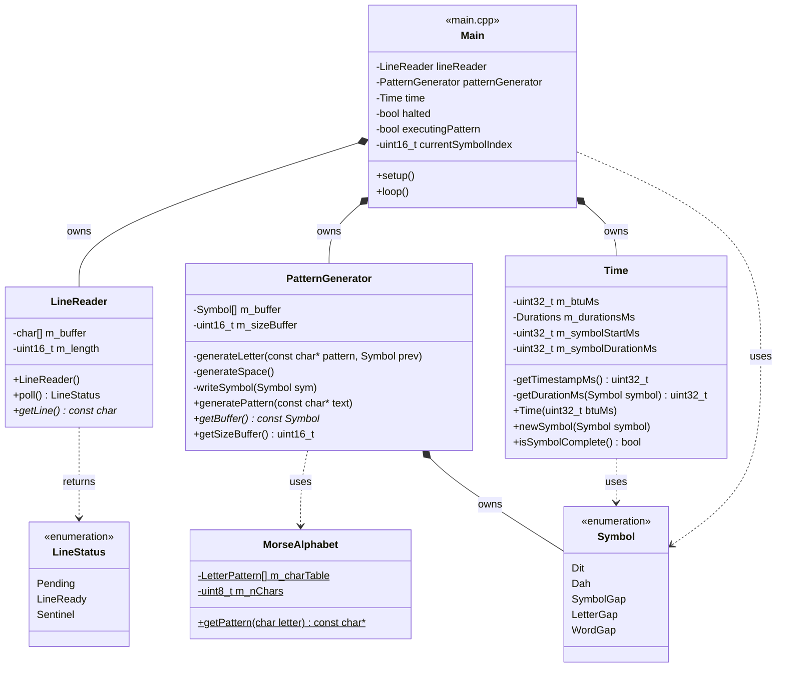

# Morse Code LED — Class Diagram

Generated from the current state of `include/*.h` and `src/main.cpp`.

## Notes on how to read this

- `$` after a member marks it `static` (e.g. `MorseAlphabet::m_charTable`, `MorseAlphabet::getPattern`) — the class-level data/behavior that isn't tied to any one instance.
- `*--` (filled diamond) is composition: `Main` owns one `LineReader`, one `PatternGenerator`, and one `Time` as direct members, and their lifetimes are tied to `Main`'s.
- `..>` (dashed arrow) is a dependency: one type uses another (as a parameter, return type, or through a static call) without owning it.
- `Main` isn't a real C++ class — it's the anonymous namespace plus `setup()`/`loop()` in `main.cpp`, represented here as a class so its relationships to the real classes are visible in the same diagram.
